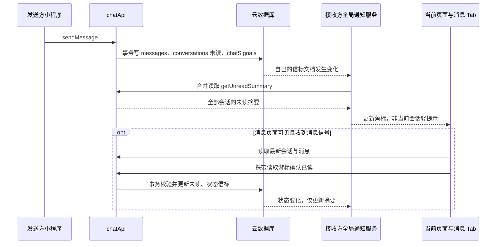

# 聊天消息通知评估与实现方案

## 结论与适用范围

当前项目采用原生微信小程序与微信云开发。对于目前的情侣、好友及小群聊天，采用**应用级云数据库实时监听 + 服务端信标 + 按事件读取摘要**，可以在首页、点单、心愿单、我们、管理分包等页面接收新消息提醒，无需定时查询消息。

服务端负责保存消息并发送“数据发生变化”的信号；前端收到信号后决定如何展示。服务端不会直接把一个弹窗下发到页面。本次使用微信原生 `wx.showToast` 轻提示，并更新消息 Tab 未读角标；用户正在阅读的会话直接刷新内容，不再提醒自己正在看的消息。这样不用在所有页面重复放置弹窗，也不会阻塞编辑表单。

本次实现的范围是**聊天消息**。好友申请、心愿订单、共同留言、菜单修改仍按原有页面访问和用户操作刷新，不承诺实时推送。小程序退到后台或完全关闭后，也不依赖前端连接持续接收消息；重新打开时会同步未读。微信外部服务通知需要另行配置订阅消息，见本文最后一节。

## 原实现的问题

| 检查项 | 原有行为 | 本次处理 |
| --- | --- | --- |
| 消息页调用频率 | 每 3 秒执行消息刷新，即使没有新消息也请求云函数 | 删除消息定时轮询，改为实际信标变化时刷新 |
| 其他页面未读 | 全局摘要刷新被注释；收到信标也主要通知消息页 | 全局通知服务维护完整未读摘要，任意前台页面均更新 |
| 首次进入与恢复 | watch 首次快照被直接忽略，缺少可靠补齐 | 每次建立连接后的首次快照同步一次摘要 |
| 信标初始化 | 初始化调用被注释；缺少集合或权限可能悄悄失效 | 显式初始化自己的信标，失败展示连接状态并允许重试 |
| 生命周期 | 页面切换与应用前后台行为不够清晰 | 页面只订阅本地事件；App 统一建立、暂停、恢复连接 |
| 异常恢复 | watch 错误后停止，没有完整恢复路径；文档所述 30 秒降级与代码不一致 | 有限次数退避重连，网络恢复、回前台和手动重试；不降级为轮询 |
| 计数一致性 | 页面会话列表与全局值都能改角标 | 以完整服务端摘要作为未读唯一来源 |
| 身份隔离 | 缓存未绑定账户；退出后迟到的登录请求可能恢复旧 session | 缓存绑定 openid；认证与通知使用请求代际，过期响应不写入 |
| 并发读写 | 消息落库、未读变化和通知可能不一致；清未读可能覆盖新消息 | 发送事务包含消息、未读及信标；已读确认校验消息游标 |
| 查询边界 | 限量会话可能遗漏计数，旧消息排序可能漏掉最新消息 | 全量分页汇总会话；按最新消息方向查询后转回展示顺序 |

## 方案选择

| 方式 | 优点 | 代价与判断 |
| --- | --- | --- |
| 定时轮询 | 接入简单 | 无消息也持续请求，有周期延迟；不采用 |
| 云数据库 `watch` | 可复用现有云开发身份、权限和数据库 | 有连接额度与数据库成本；适合当前规模，采用 |
| 自建 WSS/WebSocket 服务 | 可以自行控制协议、路由、回执 | 需管理常驻服务、鉴权、心跳、重连、消息持久化及扩容；当前收益不足 |
| 托管 IM | 更适合较大并发、群聊和复杂消息能力 | 需要 SDK、身份体系与成本迁移；作为增长后的演进方向 |
| 微信订阅消息 | 用户离开小程序后仍可通过微信服务通知触达 | 需要模板和用户授权，与前台实时聊天是两条能力链路 |

云数据库 `watch` 会在符合条件的文档变化时回调，支持主动关闭，集合读权限同样生效。腾讯官方提示该能力更适合广播，**不建议用于高并发单播**，连接上限随套餐变化。因此，本项目按用户监听一个文档的方案是针对当前规模的取舍，不能据此推断可无限扩展。[腾讯云实时推送文档](https://cloud.tencent.com.cn/document/product/876/41801)

## 数据链路与职责



### 服务端

- `messages` 保存实际消息，`conversations.unreadBy` 保存各成员未读数，`chatSignals/{openid}` 是每个用户的变化信标。
- 接收者由服务端会话成员确定，调用者必须属于会话；客户端不能任意指定要推送给谁。
- 发送消息、递增接收者未读、更新接收者信标在同一事务内完成，避免出现“发成功但通知未写入”。信标初始化也使用事务，避免覆盖恰好先到的新消息。
- 信标包含变更版本、消息版本、会话和消息 ID 等定位信息，不放聊天正文。信标是最新状态提示，不是可靠的逐条事件队列；多个事件合并后，完整摘要和最新消息查询负责恢复正确状态。
- 读取消息本身不清未读。页面拿到服务端读取游标后发出已读确认；服务端只有在会话尚未出现更新消息时清零，否则保留未读，等待下一次同步确认。
- 已读变化也发送状态信标，以便同账户其他前台会话同步角标。客户端将状态信号与新消息信号区分，避免“读消息 → 标已读 → 再读消息”的无限循环。

### 前端

- `utils/chat-unread.js` 是全局单例。只使用当前认证成功的 openid；每个前台登录实例最多一个 watch，切换页面不新增云端监听。
- `App.onHide` 关闭监听并取消待执行任务；回到前台重建连接，通过首个快照补齐期间的未读变化。首次快照不会逐条补弹历史消息。
- 相邻信标变化短暂合并后读取一次摘要。若请求进行中又有变化，完成后再补一次，避免遗漏；没有变化时不会定时请求摘要。
- 消息页只订阅本地通知事件，在可见时更新会话和消息，隐藏或卸载时解除订阅。Tab 角标读取同一份摘要。
- 非当前会话的未读增加时显示轻提示，短时间内合并提醒，不展示正文，减少打断与隐私暴露。通知不自动把用户从当前编辑页跳走。
- 退出时清理会话、openid、未读缓存和监听；旧认证响应、旧 watch 回调、旧摘要请求都不能覆盖新身份。

## 失败恢复与成本

网络异常采用最多 5 次指数退避重连；权限、集合等配置错误停止自动重试，消息页显示异常状态。预算耗尽后也停止，用户可手动重试；网络从断开恢复或应用回前台时重新尝试。重连定时器只为修复异常连接存在，不定期查询消息。没有配置好 watch 时，实时提醒暂不可用，必须修复部署，不能静默恢复高频请求。

下面是**逻辑触发次数示例**，不是价格报价：

| 前台停留 10 分钟 | 每 3 秒轮询 | 当前实现 |
| --- | --- | --- |
| 无新消息 | 约 200 次刷新触发，实际云函数次数可能更多 | 一个监听，首次连接同步一次摘要；之后没有周期消息查询 |
| 10 次分散的新消息事件 | 仍约 200 次刷新触发 | 首次同步，加约 10 次事件驱动摘要同步 |
| 多条消息短时间连续到达 | 取决于轮询周期 | 相邻事件合并；请求期间有新变化则再补一次 |
| 小程序退后台 | 取决于定时器生命周期 | 主动关闭前台监听，回前台再同步 |

“不用轮询”并不等于零成本：消息写入、每位接收者的信标写入、监听连接、推送与摘要读取仍占用平台资源；群成员越多，单条消息的通知写入越多。消息页还会按需要读取会话、消息、头像及提交已读确认，这些不计入上表摘要次数。实际额度和收费以当前云环境控制台及[套餐说明](https://cloud.tencent.com/document/product/876/75213)为准。

运行后应观察连接数、信标更新数、`getUnreadSummary` 调用数和失败日志。用户数量、群规模或消息频率明显增长时，先用真实指标测算，再将实时分发迁到托管 IM 或 WSS；不要只通过提高重试次数解决容量问题。

## 部署要求

1. 首次运行按[云开发部署说明](./cloud-setup.md)创建全部集合并部署 4 个云函数。
2. 本次更新必须重新部署 `chatApi`，并上传当前小程序前端。`authApi` 不承担信标初始化；本次仅修改前端 `utils/auth.js` 无需因此重部署 `authApi`。若同时改了 `authApi` 源代码，则另行部署对应版本。
3. 创建 `chatSignals`，权限设置为自定义安全规则：

   ```json
   {
     "read": "doc._id == auth.openid",
     "write": false
   }
   ```

   其余聊天集合仅云函数可读写。客户端只能监听自己的信标，不能修改未读、伪造推送或查看他人信标。不要为修复 watch 报错把集合开放给所有人。

4. 检查查询索引：`conversations` 的 `memberOpenids + _id`；`messages` 的 `conversationId + createdAt + _id`。字段排序及其他业务索引见部署说明，缺失时按控制台索引提示创建并等到构建完成。
5. 确认云环境、AppID、云开发权限和套餐实时连接额度。若运行在项目附带的多端宿主，需单独验证该宿主的数据库实时监听支持与身份映射；不能只用微信真机结果代替多端验收。

## 验证与验收

本地可运行 `npm test`（等价于 `node --test tests/*.test.js`）。自动化验证覆盖模拟的认证竞态、通知状态及服务端行为，不能代替已部署云环境和微信真机测试。本文列出待执行验收步骤，不表示已经发布或完成双真机验证。

使用两个真实微信账号 A、B，在同一个体验版云环境执行：

1. A 停留首页，B 向 A 发文字；A 收到轻提示，消息 Tab 未读加一。分别在点单、我们、心愿单、管理分包重复。
2. A 打开与 B 的当前会话，B 连续发送文字、图片、语音；内容正常更新，不出现多余新消息提示，读完后角标归零。
3. A 正在另一会话或好友面板，B 发消息；A 仍能得到提醒，不能误把 B 的未读清零。
4. 双方在群内连续发消息；确认不同会话未读都计入摘要，提示合并不会丢最终消息。
5. A 前台静置 10 分钟，不发消息、不切应用；查看云函数日志，不应出现每 3 秒或每 30 秒的固定消息请求。首屏头像等有限请求是正常业务加载。
6. A 退后台，B 发数条消息；A 回前台后一次快照补齐摘要，进入会话可见最新消息。后台期间不以此版本承诺微信服务通知。
7. A 断网再联网；状态变化正确，恢复后有且仅有一个有效监听。持续故障不会无限自动重试；手动重试可重新连接。
8. 在测试环境临时取消 A 的信标读权限，观察错误状态与调用日志；不得出现轮询降级。恢复权限后手动重试，并确认 A 无法读取 B 的信标。
9. A 打开会话同时 B 再发一条；确认未渲染的新消息不会被旧已读请求清掉。多端同时阅读时角标最终一致。
10. 在登录或摘要请求尚未返回时退出，再登录另一个测试身份；旧响应不得恢复前账号角标、缓存或监听。
11. 构造超过单页查询上限的会话与消息数据；确认未读总计不漏会话、界面展示最新消息。此项在独立测试环境进行。

## 离线订阅消息与后续边界

如果需求扩展为“退出小程序后，微信里也提醒我”，需要接入微信订阅消息：先在微信公众平台选用本小程序类目实际可用的模板，由用户点击触发 `wx.requestSubscribeMessage` 授权，服务端记录授权并按模板字段调用下发接口。一次性订阅需要相应授权额度；不能把一次授权理解成任意聊天的永久推送通道。[腾讯云微信小程序订阅消息实践](https://cloud.tencent.com/document/product/1301/103770)

该项目目前没有提供可用模板 ID、模板字段及适用类目确认，因此本次未加入假模板、自动授权或声称已上线离线通知。后续实现还需处理授权拒绝、额度消费、发送幂等、失败重试、频率控制及进入对应会话的路由，并用真实模板验收。

订单回应、心愿、情侣绑定变化和共同留言若也需要跨页提醒，可复用全局事件分发思路，但应各自定义事件类型、去重和读取语义，不能把这些操作无差别当成聊天未读。本次保留原业务行为。
