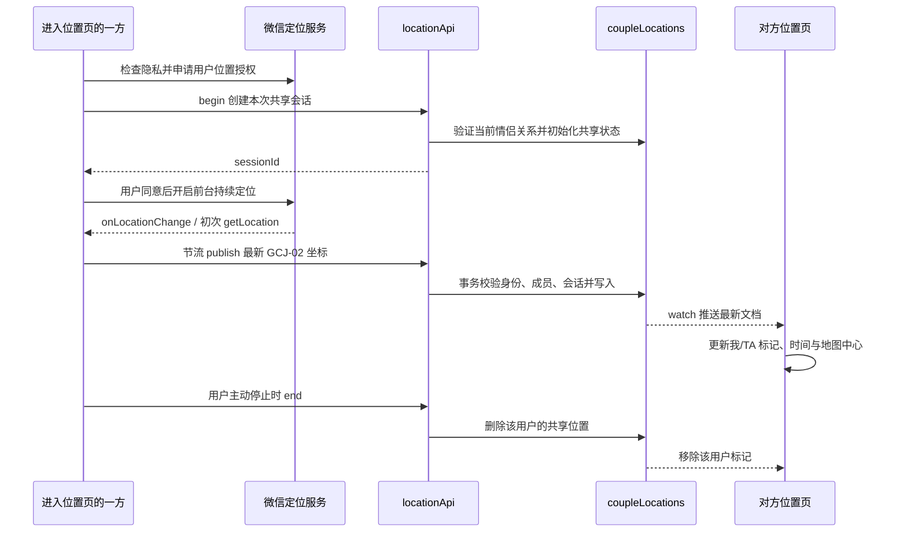

# 双人实时位置方案与部署验收

调研日期：2026-09-24。项目为微信原生小程序 + 微信云开发。

## 方案结论

底部导航调整为「今天 / 点单 / 位置 / 消息 / 我们」。位置页使用微信原生 `map`，分别标出「我」与「TA」，进入时优先显示伴侣最后共享的位置。首次进入位置页自动开始授权流程，同意后通过微信前台持续定位事件取得坐标，由云函数保存最新位置，云数据库实时监听将变化推给对方。接收端无需定时查询位置，也不需要额外点击业务层的“开始共享”按钮。

**可以在进入功能时自动申请，但不能默认替用户同意授权。** 如果尚未同意隐私指引，先显示用途说明和微信原生隐私同意按钮；隐私已同意则直接申请位置权限，位置也已授权则直接开始共享。拒绝后仍可看对方已共享的位置。双方都完成授权并产生坐标，地图才能同时显示两个位置。

本次实现前台共享：用户切到点单、消息等小程序内页面后仍继续共享；退出小程序、锁屏或微信进入后台后不再采集，另一方看到的是带更新时间的最后位置。不能将最后坐标包装成对方此刻的实际位置，也不能保证操作系统固定每秒提供定位事件。

## 调研依据与选型

微信官方接口声明明确区分前台 `startLocationUpdate` 和前后台 `startLocationUpdateBackground`，持续事件 `onLocationChange` 返回 GCJ-02 坐标；精确定位接口还受类目与接口开通约束。[微信官方 API 声明与接口注释](https://github.com/wechat-miniprogram/api-typings/blob/master/types/wx/lib.wx.api.d.ts)

腾讯位置服务的官方示例使用原生地图标记点、`startLocationUpdate` 配合 `onLocationChange`，地图坐标统一使用 GCJ-02；同时提示避免高频调用 `getLocation`。[腾讯位置服务小程序最佳实践](https://github.com/TencentLBS/tencentmap-miniprogram-skill/blob/main/quick_start_and_best_practices.md)

云数据库 `watch` 在目标文档发生变化时回调，支持主动关闭，并受数据库读权限约束。官方提示该能力存在连接额度限制，不建议直接用于高并发单播，因此这里采用它是基于当前双人共享、小规模应用及现有云开发栈的判断。[腾讯云实时推送说明](https://cloud.tencent.com.cn/document/product/876/41801)

| 选项 | 结论 | 原因 |
| --- | --- | --- |
| 原生 `map` + 前台持续定位 + 云开发 `watch` | 本次采用 | 无新增地图 SDK，复用账号和云环境；一对情侣只有一个小文档，只推最新状态 |
| 重复调用 `getLocation` / 定时拉取对方位置 | 不采用 | 静止也持续请求，增加电量、云函数调用及延迟，还受定位调用频率限制 |
| 自建 WebSocket | 暂不采用 | 仍需手机主动获取并上报坐标，还要额外维护鉴权、长连接、在线状态和持久化 |
| 后台持续定位 | 不在本次范围 | 需要额外授权、接口准入及后台能力；提高电量开销，仍不能保证进程被终止后继续采集 |
| 地图 WebView / 额外地图 JS SDK | 暂无必要 | 目前只展示地图与两个点，不需要逆地址解析、搜索或路线规划 |

本次前端没有引入腾讯地图 SDK、第三方 Key、地址解析请求或路线规划请求。后续若增加这类能力，需另外配置腾讯位置服务产品权限、额度及相关授权，不能把基础地图展示与所有地图 API 都视为同一能力。

## 权限与上线前提

这里有三个不同环节，代码声明并不代替后两个环节：

1. **工程声明**：`app.json` 的 `requiredPrivateInfos` 声明实际调用的 `getLocation`、`onLocationChange`、`startLocationUpdate`；`permission.scope.userLocation.desc` 解释向已绑定伴侣共享位置的用途。不启用 `requiredBackgroundModes: ["location"]`。
2. **平台准入**：在微信公众平台「开发管理 → 接口设置」确认三个接口已获准使用。接口开放与主体、服务类目、真实业务场景有关；仅把产品叫“点单”或“情侣空间”不能保证获准，不应填写与真实功能不符的类目。若当前主体与场景不能开通，就无法通过代码补齐实时精确定位能力，必须调整获准业务能力后再发布。
3. **用户同意**：在公众平台完善《小程序用户隐私保护指引》，如实说明精确位置、共享对象、用途及保存方式。首次进入位置 Tab 时自动检查隐私授权，再申请 `scope.userLocation`；拒绝后不采集、不上传，允许查看对方的位置和使用其他功能。曾拒绝位置授权的用户可主动进入设置重新授权。

隐私流程采用 `wx.getPrivacySetting` 查询与 `<button open-type="agreePrivacyAuthorization">`，需要同意时才出现隐私卡片；原生同意事件回调后继续申请定位，同时提供 `wx.openPrivacyContract` 查看指引。微信官方示例支持这条主动按钮路径，无需注册 `onNeedPrivacyAuthorization` 的等待回调，也不依赖 `requirePrivacyAuthorize`。隐私查询能力从基础库 2.32.3 起可用。[微信官方隐私 API 与完整示例](https://raw.githubusercontent.com/wechat-miniprogram/api-typings/master/types/wx/lib.wx.api.d.ts)

微信开发者文档页面在本次调研环境无法直接打开，因此 API 参数、前后台区别与准入说明交叉核对了微信团队官方 `api-typings` 和腾讯位置服务官方仓库。实际账号能否开通，以该 AppID 的公众平台和提审结果为准；本地通过测试不等于平台已允许上线。

## 数据链路



### 服务端与数据权限

- 新增云函数 `locationApi`，动作包括 `ensure`、`begin`、`publish`、`end`。
- 新增集合 `coupleLocations`，以 `coupleId` 作为文档 ID；包含 `active`、`memberA`、`memberB`、`positions`、`updatedAt`、`version`。`positions` 以用户 openid 区分双方，只保留各自最后坐标、精度、服务端更新时间和共享会话标识。
- 云函数从 `cloud.getWXContext()` 获取调用者身份，并在事务中检查 `users`、`couples`、另一方当前所属空间。客户端传入任意 openid、coupleId 均不能代替服务端身份校验。
- 每次开启生成新的共享会话标识。上传和停止都校验本次会话，防止旧设备、过期上传或迟到的停止请求覆盖新会话。
- 服务端强制两次坐标写入至少间隔 5 秒，并校验有限数值、经纬度范围与精度。每次写入覆盖最新状态，不存历史轨迹；并发双方上传通过事务保留彼此的字段。
- 客户端只能读取自己所属、仍有效的共同文档，不能直接写入。解绑时同步撤销读取权限并清除共享数据，旧成员不能继续读取或更新。不要为解决监听报错而开放整个集合。

### 前端与页面行为

- 位置服务为应用单例：定位采集和上传不依赖位置页是否可见，所以切到消息、点单仍可共享。地图页面只订阅服务状态并渲染地图。
- 首次进入默认聚焦 TA；TA 尚未共享时展示等待状态，有自身坐标则可显示自己的点，不把示例经纬度冒充任何人的位置。
- 允许用户切换看自己、看对方、看双方，并可手动拖动地图。重新进入页面恢复默认看对方。
- 初次定位和持续定位都统一为 GCJ-02。服务端保存经纬度与精度，页面展示更新时间，避免经纬度系不一致造成肉眼可见的偏移。
- 首次进入位置 Tab 自动启动授权流程；在首页或其他业务页启动小程序不会主动采集。用户明确停止后，按当前账号和绑定空间保存关闭偏好，再次切入位置页不会自行重新开启，应由用户选择恢复。手动停止会立即停采集、取消待上传任务，并请求服务端删除自己的位置。若停止请求因断网失败，页面明确提示清除未成功；网络恢复、回前台或手动重试时再提交清除。
- 小程序进入后台时停止采集与连接；回前台按本次用户选择和当前登录、绑定、权限状态恢复。退出登录或绑定身份变化后清理旧会话、缓存和回调，旧异步结果不能写入新账号。
- 连接异常使用有限退避重连，并在网络恢复、回前台或手动重试时重新建立监听；不降级成定时查询。

## 更新速度与资源预算

实时位置必须经过“设备产生有效坐标 → 上报 → 云端写入 → 对方收到推送”。服务端可以推送数据，不能在没有对方授权、对方离线或系统不提供定位时凭空得知其位置。

上传按原生定位事件触发：首次有效定位立即上传，此后至少间隔 5 秒，并且移动达到 20 米，或距离上次成功上传达到 30 秒才上报。30 秒条件必须有新的原生定位回调，不使用定时任务反复上报旧点。短时间内的多个点只保留最新一个，最后一帧按 5 秒窗口合并补发；服务端再次限制写入频率。

页面每 15 秒仅在本地刷新相对时间，超过 90 秒未更新的位置标记为旧位置；这不是对方是否在线的确定证据。界面计时器不查询数据库，为补发最新位置使用的一次性延迟任务也不是查询轮询。

以 5 秒最短间隔计算，持续移动的单个用户每小时前端正常上报约不超过 720 次，另有有限的初始化、停止和恢复请求；两人同时移动约 1440 次。静止且持续收到系统回调时，上报约每 30 秒一次，即约 120 次 / 人 / 小时；没有新回调就不上传。每次事务可能包含多次数据库读取及写入，不能将此数字等同于数据库计费次数。位置页关闭且自己也未共享时关闭位置 watch；自己正在共享时保留一个监听以接收会话替换或解绑变化。

精确定位本身仍会耗电；减少网络请求不能消除 GPS 与系统定位能耗。应该在真实手机上观察功耗、坐标抖动、上报次数和 watch 连接数。用户规模明显增加后，以云环境实际账单与连接额度评估迁移到 WSS / 托管实时服务，而不是任意提高频率。

## 部署

1. 按[云开发部署说明](./cloud-setup.md)创建 `coupleLocations`。
2. 将该集合设为自定义安全规则：

   ```json
   {
     "read": "doc.active == true && (doc.memberA == auth.openid || doc.memberB == auth.openid)",
     "write": false
   }
   ```

   文档 `_id` 即 `coupleId`，按 ID 监听不需要新增复合索引。规则中的 `active` 和成员字段只能由云函数写入。
3. 新部署 `locationApi`，同时重新部署包含解绑清理逻辑的 `coupleApi`，使用“上传并部署：云端安装依赖”。更新小程序前端。
4. 在公众平台检查接口准入与隐私指引，并使用较新微信客户端、基础库进行双真机体验版验证。开发者工具的模拟坐标不能证明持续定位与授权行为在真机上成立。
5. 本次代码不包含后台定位、不包含持续定位权限代申请，也没有替账号在公众平台发布版本。若已有绑定数据，首次访问位置功能由 `ensure` 初始化位置文档，无需手工写入双方 openid。

## 真机验收

这些是部署后的验收步骤，不表示已经完成云端发布或双真机验证。

| 场景 | 预期 |
| --- | --- |
| Tab 顺序 | 今天、点单、位置、消息、我们；原消息角标与页面选中状态仍正确 |
| 未登录或未绑定 | 展示登录 / 绑定提示；不请求定位、不上传位置 |
| 首次进入位置 Tab | 自动检查隐私与位置权限；隐私未同意才显示原生同意按钮，已同意则直接申请定位；同时加载 TA 已共享的位置 |
| 同意隐私与定位 | 自动开始共享，出现自己标记，对方收到自己的点；首次地图中心仍优先 TA |
| 拒绝隐私、首次拒绝定位、曾经拒绝定位 | 无上传，界面有可理解提示；允许主动去设置恢复，不反复弹窗 |
| 系统关闭定位、低精度或无 GPS 信号 | 定位失败时显示异常；最后位置的更新时间变旧，不伪造新的成功定位 |
| A 位置页，B 切到点单或消息并移动 | A 通过 watch 收到 B 的新位置；B 没有重复创建定位监听 |
| 双方同时移动 | 两个点都更新；云端不会由后写入的一方覆盖另一方的数据 |
| B 退后台、锁屏或强退 | A 能区分最后位置与新鲜位置，时间变旧；不承诺后台实时移动 |
| B 手动停止共享 | B 停止采集；联网确认后 A 的 B 标记消失；再次切入 Tab 不自动恢复，选择重新共享才建立新会话 |
| 断网再恢复 | 没有无限轮询；有限恢复后只发最新位置，不能批量补发历史轨迹 |
| 快速切页、前后台与停止 / 开启交错 | 不重复监听；旧请求不能重启已停止的共享或覆盖新会话 |
| 同账号在另一设备重新开启共享 | 旧会话后续上传和停止不能影响新会话 |
| 主动解绑 | 位置文档撤权 / 清空；原伴侣不再收到新位置，旧上传被拒绝 |
| 新配对或换账号 | 不显示之前配对的坐标，不沿用之前的共享会话 |
| 第三个账号请求文档、客户端尝试写入 | 被数据库权限与服务端校验拒绝 |
| 云函数与集合未部署 / 权限错误 | 显示配置或连接失败，可重试；不会悄悄变成定时拉取 |
| 静置与移动分别 10 分钟 | 查看 `locationApi` 调用和数据库记录，确认节流、只保留最新位置及无周期读取 |
